# LUAS WQI portal — feature guide

A page-by-page list of what the portal does, with a picture of each feature.
Live site: <https://uzma-geospatial-ai.github.io/LUAS_Prototype/>

Screenshots were taken from the live prototype on 22 September 2026. Station readings, licences and TMDLs shown in them are **sample data**, simulated for demonstration; the geography (rivers, water bodies, premises, boundaries) is real open data.

The portal has four pages — **Map**, **Station assessment**, **Water quality trends**, **TMDL & licences** — plus tools (report export, backup download) that work from any page.

---

## 1. Shell — what is on every page

| # | Feature | Where | What it does | Screenshot |
|---|---------|-------|--------------|------------|
| 1.1 | Portal layout | Whole app | Sidebar navigation on the left, app bar on top, page content in the middle. Four pages and two tools. | 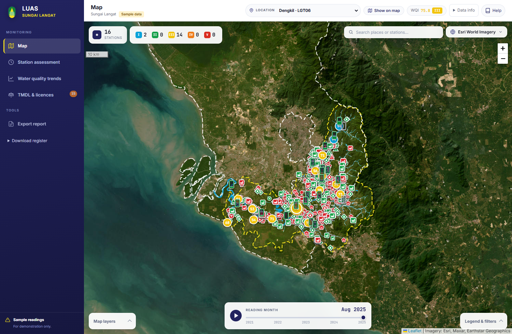 |
| 1.2 | Navigation | Sidebar | Switch between Map, Station assessment, Water quality trends and TMDL & licences. Tools below: Export report, Download register (JSON / CSV). | 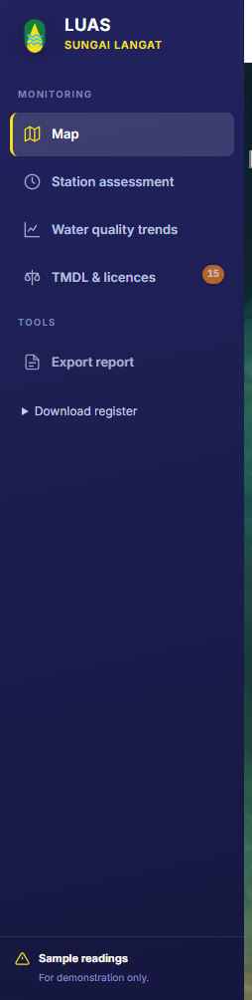 |
| 1.3 | Location picker | App bar | One picker chooses the location for **every** page. The list starts with **＋ Add a new location** and **Edit this location**. Next to it, **Show on map** opens the map centred on that location, and the WQI pill shows its latest index and class. | 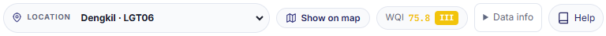 |
| 1.4 | Data info | App bar | Explains that readings are simulated, shows the record coverage, the target class and how often it was met, and the data source. | 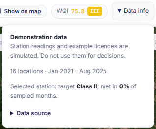 |
| 1.5 | Licence warning badge | Sidebar | The count on TMDL & licences is the number of licences that need attention: running out inside the warning window, already expired, or with no expiry date on record. |  |
| 1.6 | Glossary / Help | App bar → Help | Searchable glossary of every term used in the portal (WQI, INWQS class, TMDL, ΣWLA, ΣLA, MOS, Standard A/B, …). | 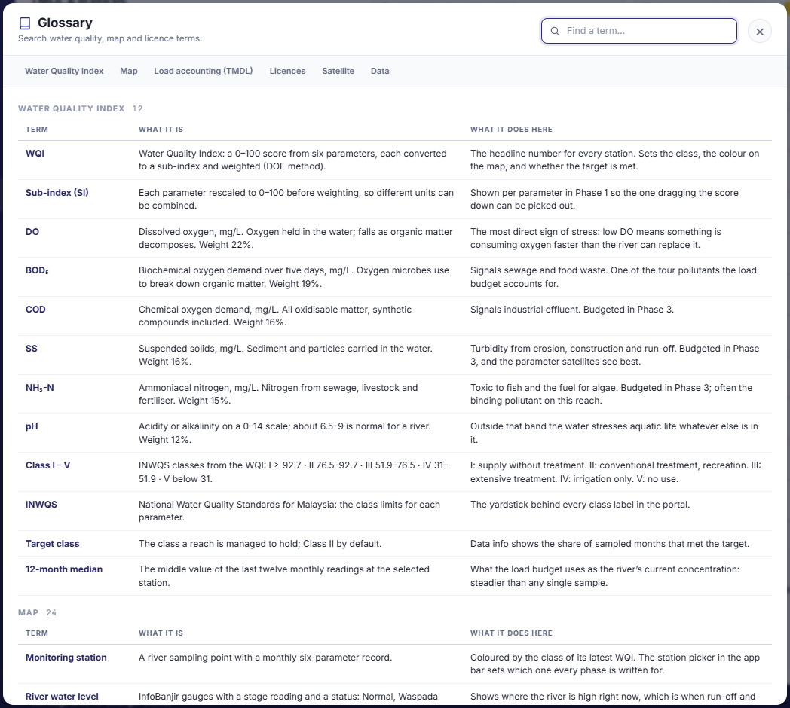 |
| 1.7 | Sources & credits | Footer | Data sources and imagery credits. SESAMS (MYSA's land-activity monitoring for LUAS) is linked here as a separate system. | 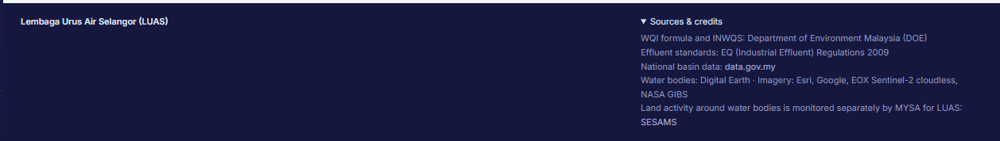 |
| 1.8 | Phone layout | Any page | Everything works at phone width: the sidebar collapses behind a Menu button and the cards stack. | 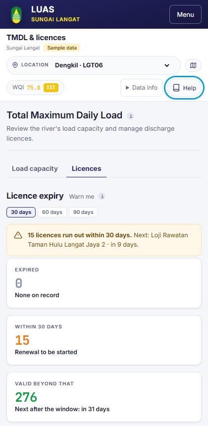 |

---

## 2. Map

| # | Feature | Where | What it does | Screenshot |
|---|---------|-------|--------------|------------|
| 2.1 | Search places or stations | Map, top right | Type a name: monitoring stations, rivers, water bodies, JPS water-level gauges and surveyed premises match as you type. Picking one flies the map there. | 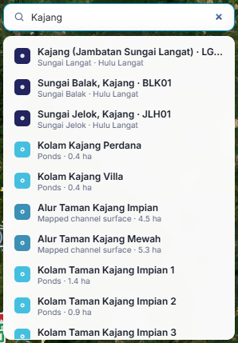 |
| 2.2 | Basemaps | Map → Basemap | Esri World Imagery, Google Satellite, Google Hybrid, Sentinel-2 Cloudless, VIIRS daily, false colour 7-2-1 daily (with acquisition date), Street map, Topographic. Each has a note on resolution and best use. | 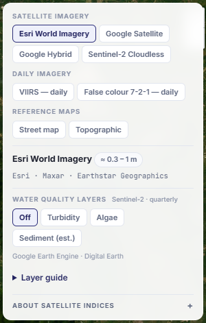 |
| 2.3 | Sentinel-2 basemap | Map → Basemap | Example of the 10 m Sentinel-2 cloudless mosaic under the overlays. | 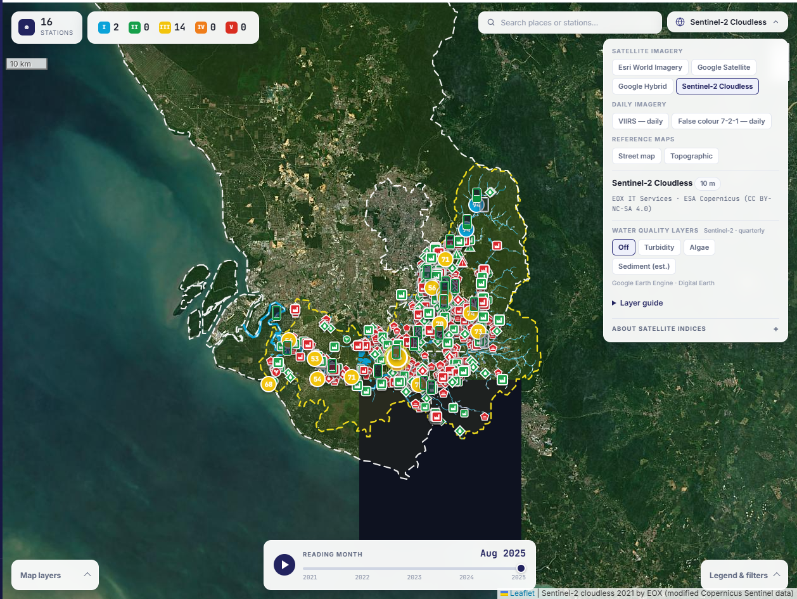 |
| 2.4 | Satellite water-quality products | Map → Basemap → product buttons | Turbidity (NDTI), Algae (NDCI) and Suspended solids (estimated, mg/L) by quarter. The SS product is shown **whole and unfiltered** — the full raster, not clipped to mapped water bodies. | 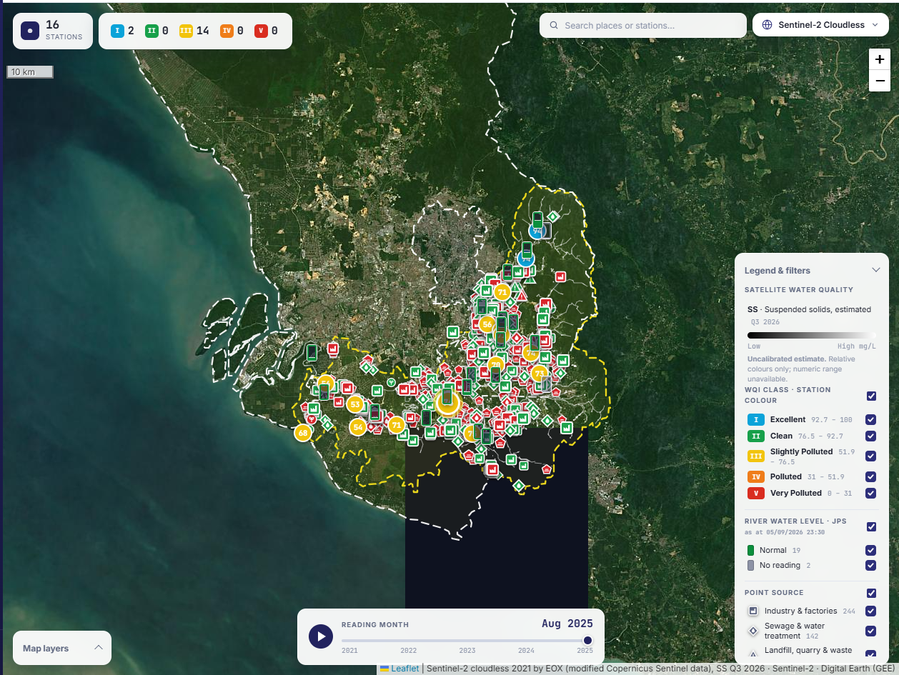 |
| 2.5 | Turbidity index | Map → Basemap → Turbidity | NDTI product for the chosen quarter, drawn over the water bodies. "About satellite indices" explains each index. | 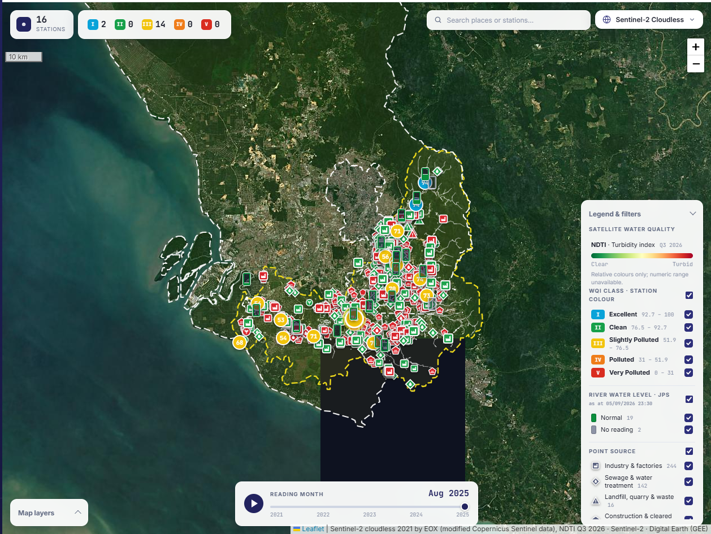 |
| 2.6 | Map layers | Map, bottom left | Toggle monitoring stations, JPS river water levels, water bodies, rivers, flow direction (rivers only — water bodies are not animated), point sources, licences, Langat catchment, Selangor boundary. Each shows its count. | 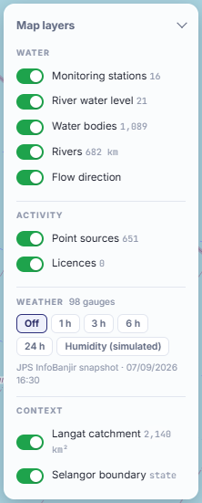 |
| 2.7 | Legend & filters | Map, bottom right | Legend doubles as a filter: tick or untick WQI classes, water-level states, point-source types, water-body types and boundaries. | 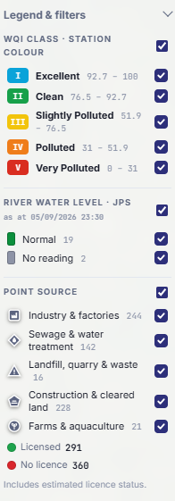 |
| 2.8 | Reading-month timeline | Map, bottom | Slider across the whole record (2021 → latest). Press play to animate; station colours change month by month. | 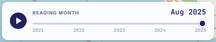 |
| 2.9 | Station popup | Click a station | WQI, class, the parameters outside the target class, a fold with every reading against its limit, and a button straight to the station assessment. | 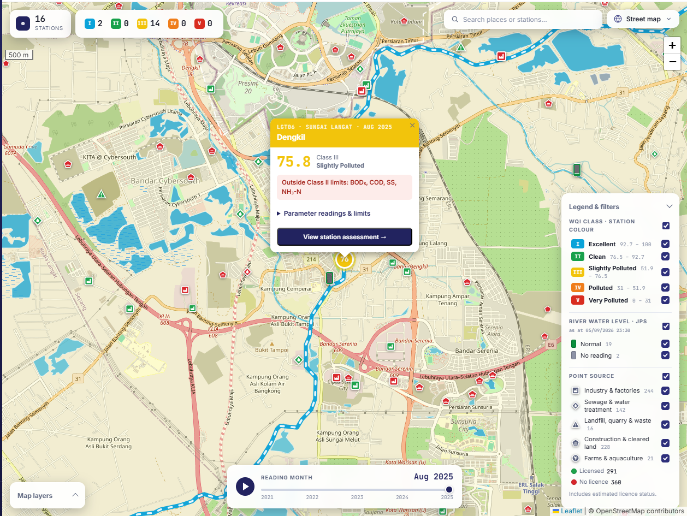 |
| 2.10 | Premises popup & flash | Click a premises / "Map" buttons elsewhere | Nearest water and distance, screening risk, licence (with expiry countdown), typical pollutants. Any "Map" or "Show on map" button in the portal selects and zooms to the item and **flashes it** so it can be found. | 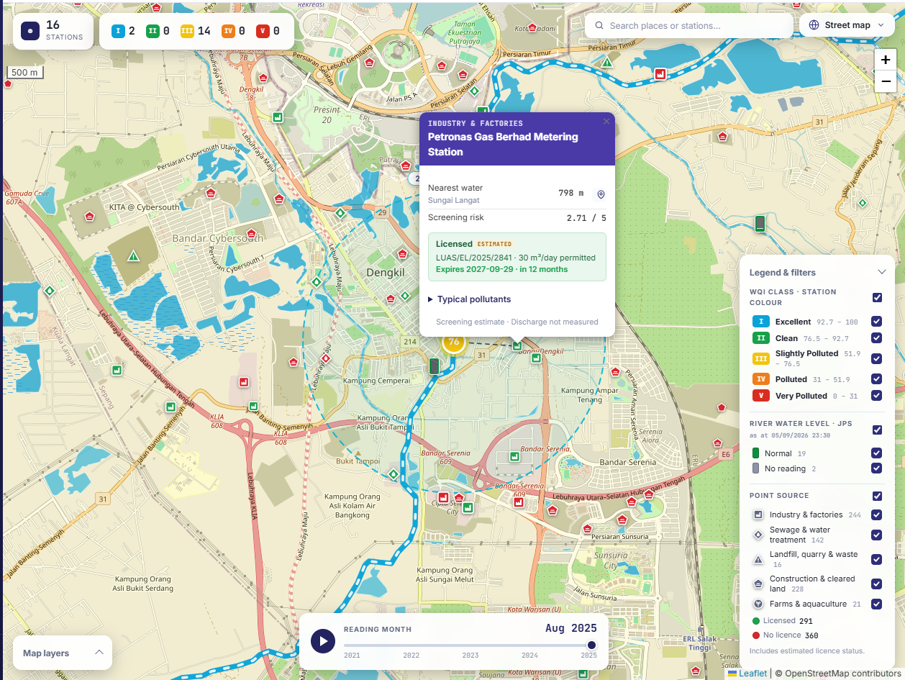 |
| 2.11 | River reach flash | TMDL card → Show on map | The reach a TMDL applies to is highlighted and blinks; hovering a river shows its mapped length and estimated flow in m³/h. | 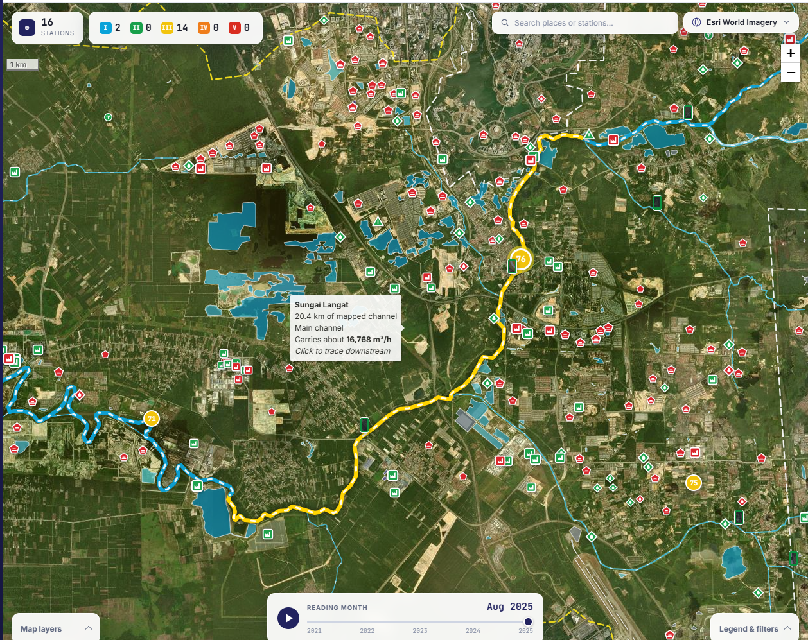 |

---

## 3. Station assessment

| # | Feature | Where | What it does | Screenshot |
|---|---------|-------|--------------|------------|
| 3.1 | Station verdict | Top of page | Whether the chosen month meets the target class, the WQI and its class, months meeting the target over the record, and the most frequent failing parameter. Month arrows step through the record. | 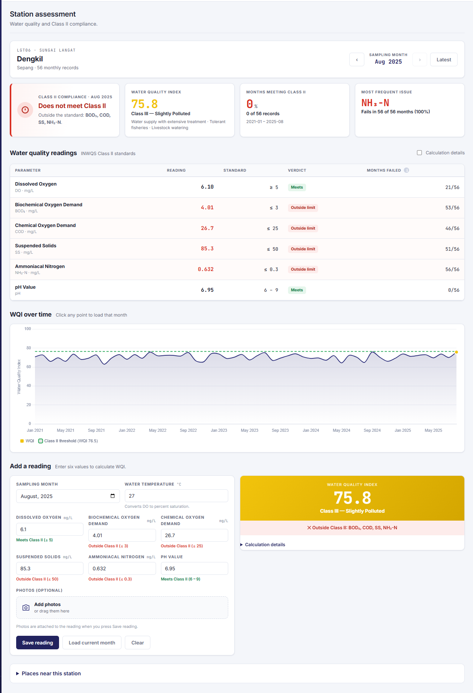 |
| 3.2 | Readings against INWQS | Water quality readings | Each parameter's reading, the Class II standard, a Meets / Outside-limit verdict and how many months it failed. "Calculation details" adds % of limit, sub-index and weight. | 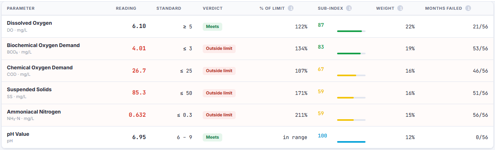 |
| 3.3 | WQI over time | Chart | WQI for every month against the class threshold. Click a point to load that month. | 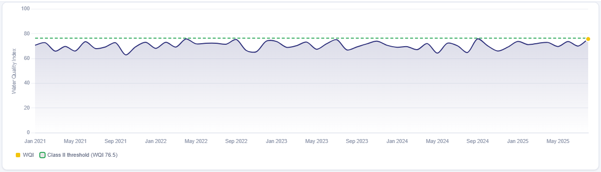 |
| 3.4 | Add a reading + photos | Add a reading | Enter six values and temperature; the WQI is computed live with each value checked against the standard. Photos can be dropped in (resized in the browser, up to 8 per record) and are stored **when Save reading is pressed** — the button shows how many photos it will save. | 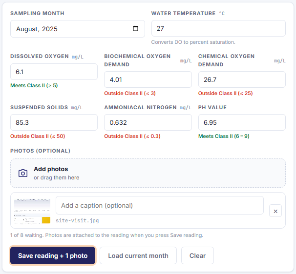 |
| 3.5 | Saved photos | Below the chart | Photos attached to readings at this station, by sampling round, with a lightbox. They also go into the exported report. | 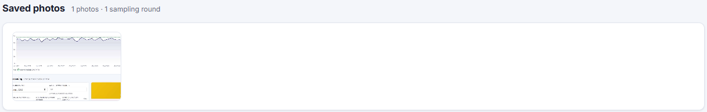 |
| 3.6 | Places near this station | Fold at the bottom | Choose a radius (500 m to 10 km). Surveyed premises within it, with distance, distance from water, screening risk and licence status, each with a Map button. **Search within N km** then asks OpenStreetMap live for shops, workshops, restaurants, clinics and offices, grouped by what they typically send to the drain. | 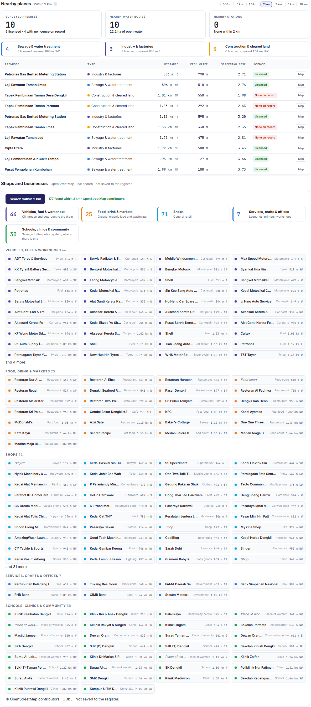 |

---

## 4. Water quality trends

| # | Feature | Where | What it does | Screenshot |
|---|---------|-------|--------------|------------|
| 4.1 | Exceedance cards | Top of page | For each parameter, the share of months outside the target class at the chosen station, the latest value and the limit. | 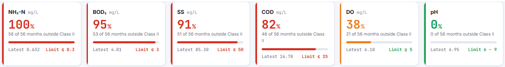 |
| 4.2 | Parameter trend charts | Middle | Monthly series for each parameter with the standard drawn as a line. | 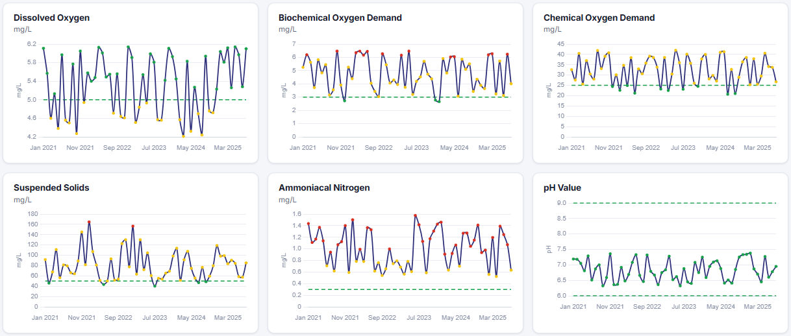 |
| 4.3 | Water bodies in the catchment | Fold | Counts and surface area of treatment basins, lakes and reservoirs, ponds, mapped channel surface and other open water. | 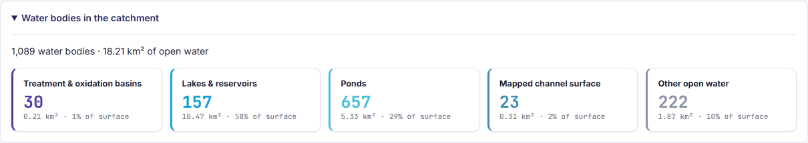 |
| 4.4 | Compare with national trends | Fold | data.gov.my pollution status of Malaysian river basins, 2000–2021, per parameter. | 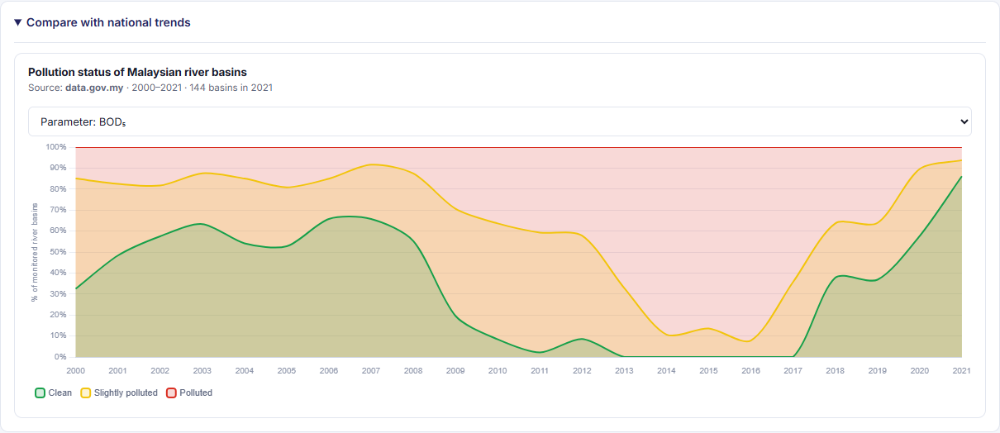 |

---

## 5. TMDL & licences — Load capacity tab

| # | Feature | Where | What it does | Screenshot |
|---|---------|-------|--------------|------------|
| 5.1 | TMDL bar | Top of tab | The location in force, which TMDL record is loaded (each location keeps its own records), and New / Edit / Delete. | 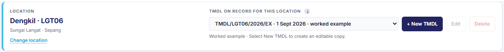 |
| 5.2 | TMDL card | Below the bar | The loaded TMDL: reference, target class, design flow in **m³/h** (estimate or gauged), the meter readings it came from, and for each pollutant the **ΣWLA + ΣLA + MOS = TMDL** figures against the loading capacity. Show on map flashes the reach. | 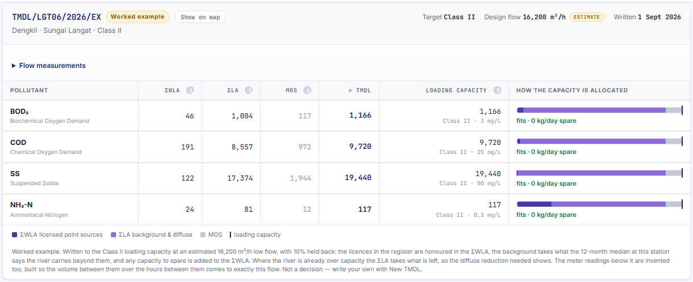 |
| 5.3 | Headline verdict | Below the card | Whether the TMDL fits the river, how much is licensed, and what is left to licence (never below zero). | 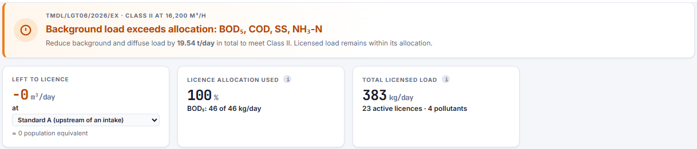 |
| 5.4 | Pollutant budget | Table | Per pollutant: standard, what the river carries, the TMDL terms, the licensed load and the balance. Every column ruled so rows read clearly. | 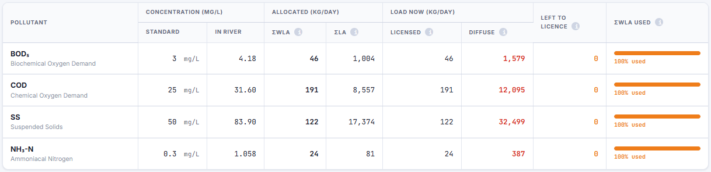 |
| 5.5 | Allocation chart | Chart | ΣWLA, ΣLA and MOS stacked against loading capacity for each pollutant. | 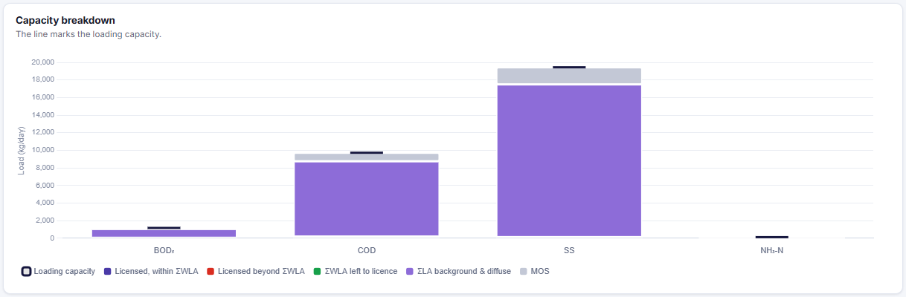 |
| 5.6 | New TMDL dialog | + New TMDL | Popup form. Reference, title, date, target class, design flow. **Meter readings** (bacaan awal / bacaan akhir with times) derive the flow in m³/h. Enter ΣWLA, ΣLA and MOS per pollutant as **inputs** — the TMDL is their sum and is checked against capacity; **Write to capacity** fills a suggestion at a chosen MOS %. Notes and photographs attach to the record. | 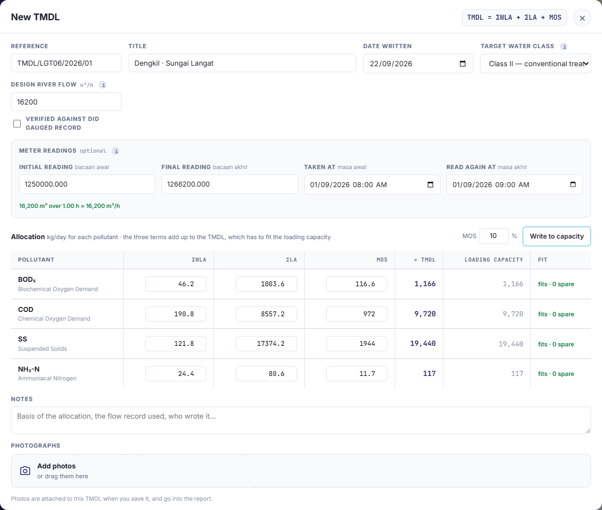 |

Design flow differs per location: it is scaled from the reach each station drains, so the TMDL, ΣLA and MOS change when the location changes.

---

## 6. TMDL & licences — Licences tab

| # | Feature | Where | What it does | Screenshot |
|---|---------|-------|--------------|------------|
| 6.1 | Licence form | Top of tab | Add a discharge licence: pick surveyed premises or enter new ones with coordinates (Use map centre / Show on map), the station it counts at, issue and expiry dates, permitted flow, effluent standard A/B, permitted BOD, COD, SS, NH₃-N and oil & grease, plus photos. Each concentration is checked against the standard as you type. | 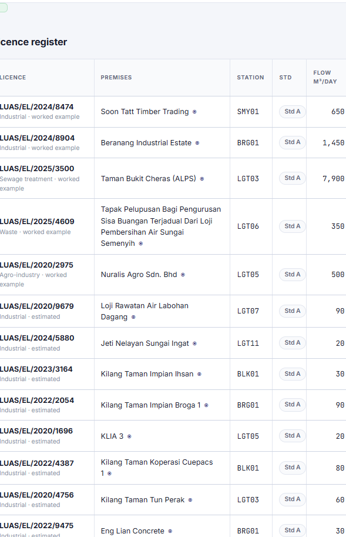 |
| 6.2 | Licence register | Table | Every licence: premises, station it counts at, standard, flow, permitted concentrations, wasteload in kg/day, **RM/month**, expiry and status; sortable, searchable, paged; Renew on every row, Edit / Delete on your own entries, the ⊙ beside a premises name opens it on the map, and totals at the foot. | 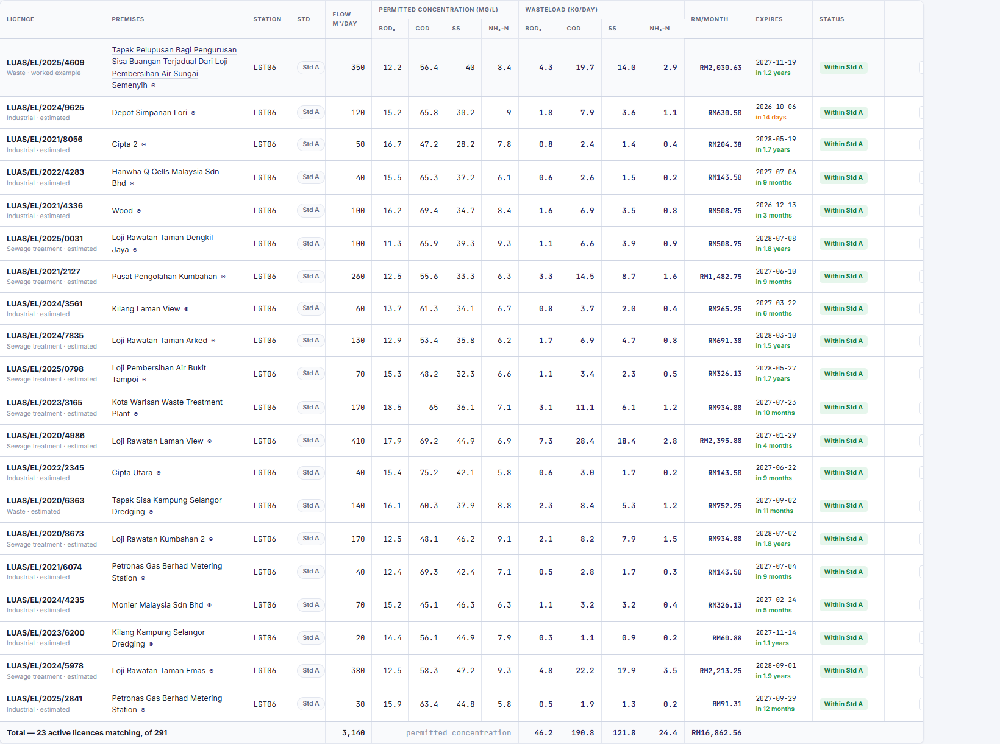 |
| 6.3 | Licence expiry | Below the register | Warning window of 30 / 60 / 90 days. Tiles for expired, expiring, valid and **no date on record**. A countdown per licence, a table of licences with no expiry date asking for the term to be entered, and a **Renewals recorded** log. | 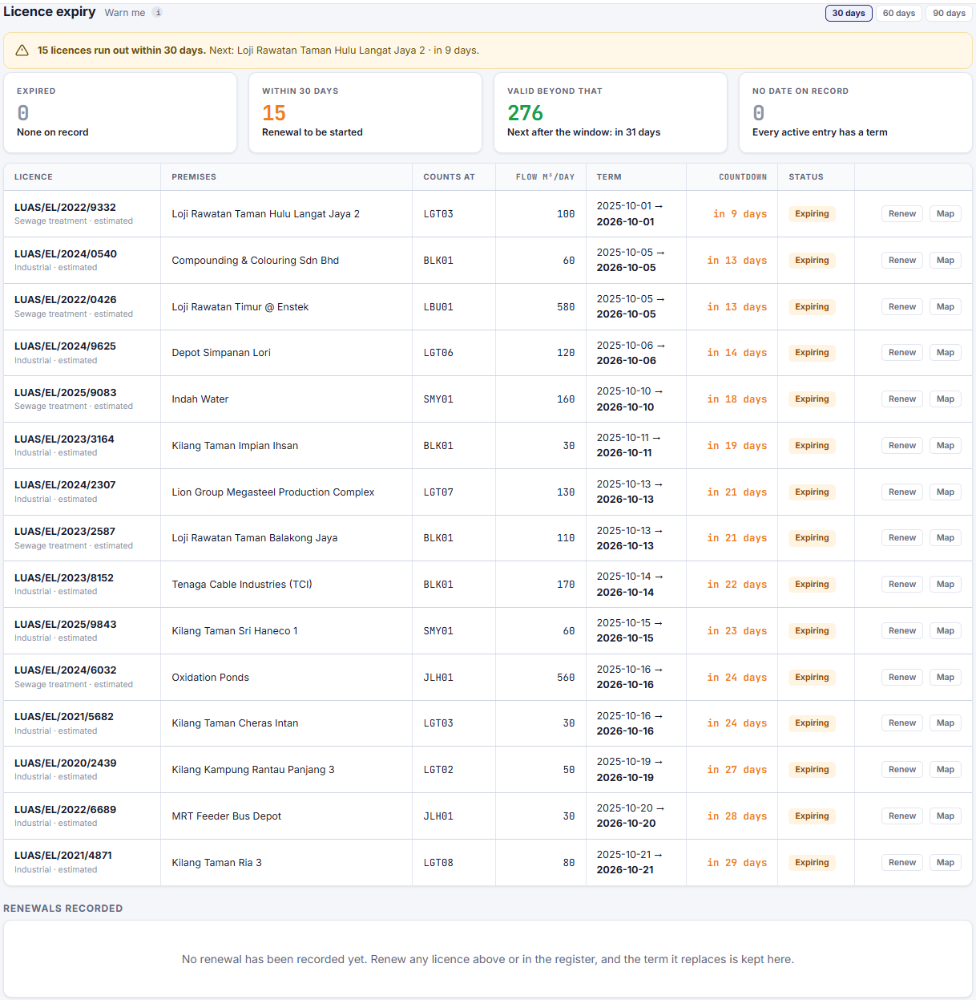 |
| 6.4 | Renew a licence | Renew button | Popup: new term (defaults to a year on from the old expiry), new reference, note. The old term is kept in the renewal log. | 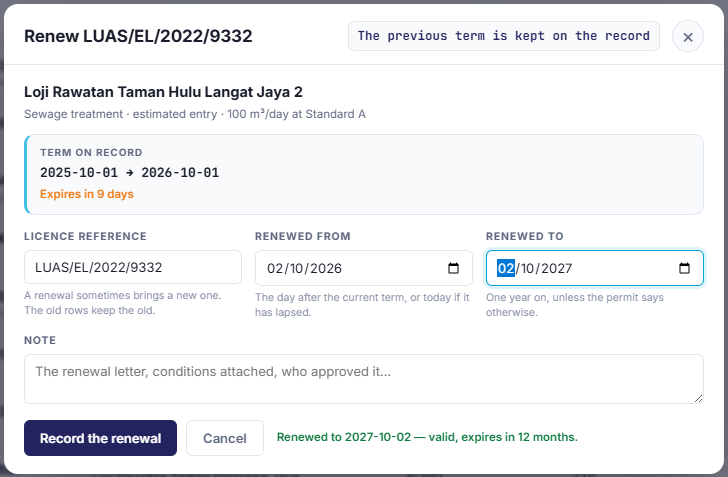 |
| 6.5 | Charges | Bottom of tab | What each discharge is charged a month: return water at RM0.10–0.20 per m³ (tiered, from the LUAS schedule) and pollutant mass per kg **above** the standard (Fourth Schedule). The schedule is editable; figures not in the source are marked *assumed* and per-kg rates are left at 0 until LUAS supplies them. | 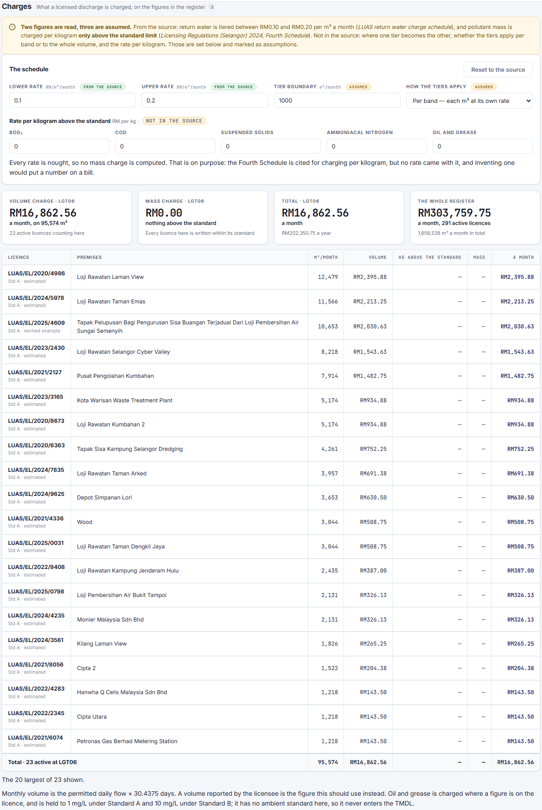 |
| 6.6 | Backup, spreadsheet, import | Bottom of tab / sidebar | Download everything as JSON (readings, licences, TMDLs, locations, charge schedule) or the register as CSV; import a backup; hide or restore the example licences. | 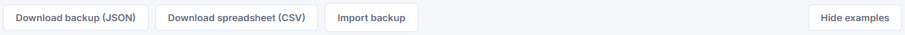 |

---

## 7. Locations and tools

| # | Feature | Where | What it does | Screenshot |
|---|---------|-------|--------------|------------|
| 7.1 | Add a new location | Location picker → ＋ Add a new location | Popup form: station code, name, type, river, district, reach, coordinates (or Use map centre), notes. The location is added to the map and to every picker; readings can then be entered for it. | 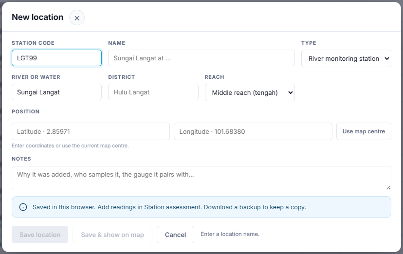 |
| 7.2 | Export report | Sidebar → Export report | Choose the location, the basemap for the captured map (any of the eight, with a date for daily imagery), zoom, and which sections to include: map, station assessment, trends, TMDL, licences, photos. | 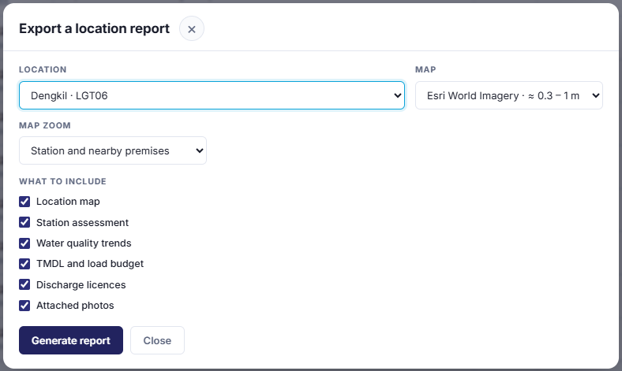 |
| 7.3 | The report | Generated file | Official layout with the LUAS letterhead, report reference, document-control block, summary table, captured map with scale bar and legend note, then the chosen sections. Opens in a tab, prints to PDF, or downloads as HTML. | 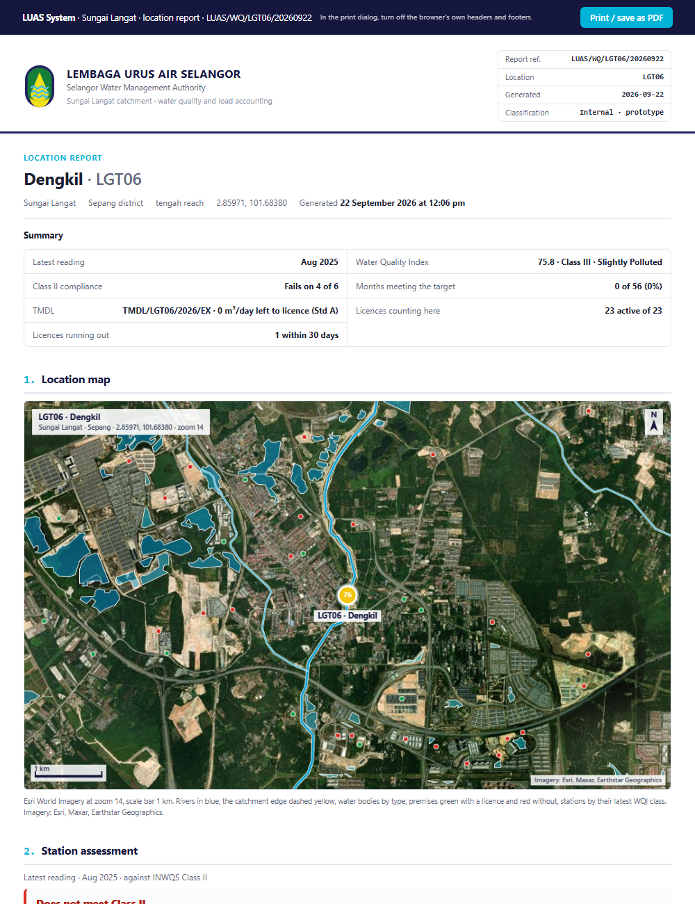 |

---

## Where the data lives

- Everything a user enters (readings, photos, TMDLs, licences, renewals, locations, the charge schedule, warning window) is stored in the browser (`localStorage`). Download a backup to keep a copy or move it to another machine.
- Reference data (stations, rivers, water bodies, premises, boundaries, water levels) is read from the site's `data/` folder with a Firebase fallback.
- Satellite products are PMTiles served from the Digital Earth bucket; daily imagery comes from NASA GIBS.
